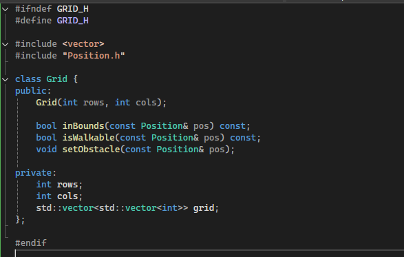
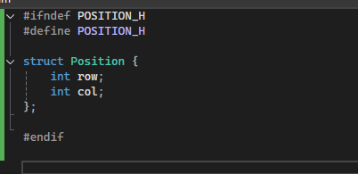
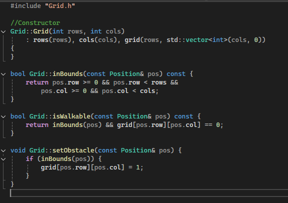
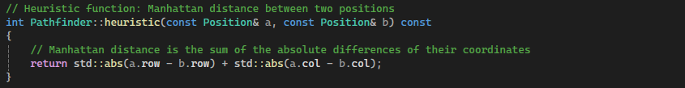
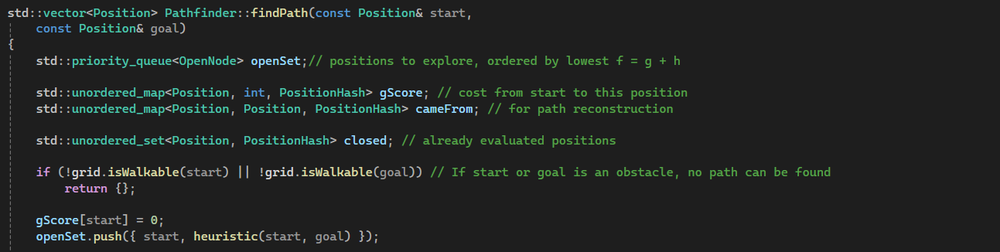
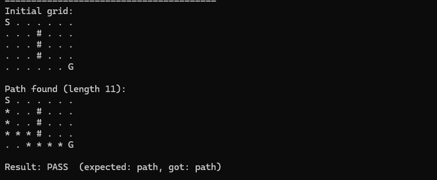

# A* Pathfinding Algorithm

## Introduction

This project involves implementing the A* pathfinding algorithm in C++ using a grid-based environment. The goal is to understand how A* works in practice and to apply it using clean, modular, and modern C++ code.

The program represents a two-dimensional grid where each cell can either be free or blocked by an obstacle. Given a start position and a goal position, the algorithm searches for the shortest valid path while avoiding obstacles and staying within grid boundaries. If no path exists, the program reports this clearly.

---

## Week 1 – Grid Representation and Core Data Structures

In Week 1, I focused on establishing the data structures and constraints required for A* before implementing the algorithm itself. The goal was to create a grid representation that supports safe neighbour expansion, obstacle handling, and boundary validation.

### Grid Representation

I implemented the environment as a two-dimensional grid using a `std::vector<std::vector<int>>`. Each cell is either `0` (traversable) or `1` (obstacle). This allows direct access to neighbouring cells using row and column indices, which aligns naturally with grid-based pathfinding.

```cpp
class Grid {
private:
    int rows;
    int cols;
    std::vector<std::vector<int>> grid;
};
```

Using a dynamic 2D vector allows the grid size to be configured at runtime and avoids manual memory management, while still providing the efficient indexed access A* requires.



### Position Abstraction

To represent nodes within the grid, I created a `Position` structure containing row and column coordinates. This is used throughout the project to describe the start, goal, neighbours, and the final path.

```cpp
struct Position {
    int row;
    int col;

    bool operator==(const Position& other) const {
        return row == other.row && col == other.col;
    }
};
```

The `operator==` overload is essential — it allows the algorithm to compare two positions directly with `==`, for example when checking `if (current == goal)`. Without it the compiler would not know how to compare two `Position` values.



### Boundary Validation

When expanding neighbours, it is possible to generate positions outside the grid. The `inBounds` function guards against this:

```cpp
bool Grid::inBounds(const Position& pos) const {
    return pos.row >= 0 && pos.row < rows &&
           pos.col >= 0 && pos.col < cols;
}
```

Centralising this check within `Grid` means all pathfinding logic can rely on it without duplicating the boundary logic.

### Walkability and Obstacles

`isWalkable` combines boundary validation with obstacle checking in a single call:

```cpp
bool Grid::isWalkable(const Position& pos) const {
    return inBounds(pos) && grid[pos.row][pos.col] == 0;
}
```

This means the pathfinder only ever needs to ask one question — "is this walkable?" — and gets a safe answer covering both cases. Obstacle placement is handled separately:

```cpp
void Grid::setObstacle(const Position& pos) {
    if (inBounds(pos)) {
        grid[pos.row][pos.col] = 1;
    }
}
```



### Week 1 Outcome

By the end of Week 1, I had a working grid environment with node representation, boundary checking, obstacle placement, and visual output. This foundation meant that Week 2 could focus entirely on search logic without revisiting structural concerns.

- `isWalkable` checks both bounds and whether a cell is blocked
- A small test confirmed obstacles and bounds behave correctly
- No A* logic yet — Week 1 was only about the foundation

---

## Week 2 – Implementing the A* Algorithm

In Week 2, I implemented the core A* pathfinding algorithm. The goal was to move from a working environment to a complete search that finds the shortest path from start to goal while avoiding obstacles.

### Neighbour Generation

The first step was implementing `getNeighbours` as a dedicated helper. From a given position, it generates the four candidate directions and filters them through `isWalkable`:

```cpp
std::vector<Position> Pathfinder::getNeighbours(const Position& pos) const
{
    std::vector<Position> neighbours;

    std::vector<Position> directions = {
        { -1,  0 },  // up
        {  1,  0 },  // down
        {  0, -1 },  // left
        {  0,  1 }   // right
    };

    for (const auto& dir : directions)
    {
        Position next{ pos.row + dir.row, pos.col + dir.col };
        if (grid.isWalkable(next))
            neighbours.push_back(next);
    }

    return neighbours;
}
```

The directions are row/column offsets. For example from `{2,3}`, applying `{-1,0}` gives `{1,3}` (up) and `{0,1}` gives `{2,4}` (right). Any candidate that fails `isWalkable` is discarded before it can cause issues.


### Heuristic Function — Manhattan Distance

The heuristic estimates the remaining distance from any cell to the goal:

```cpp
int Pathfinder::heuristic(const Position& a, const Position& b) const
{
    return std::abs(a.row - b.row) + std::abs(a.col - b.col);
}
```

This is Manhattan distance — the row gap plus the column gap. It is the correct heuristic for 4-direction movement because with only up/down/left/right available, the minimum steps to the goal can never be less than the row gap plus the column gap. A heuristic must be **admissible** — it must never overestimate — and Manhattan distance satisfies this.



### Core A* Structures

The main loop uses four data structures:

```cpp
std::priority_queue<OpenNode> openSet;
std::unordered_map<Position, int, PositionHash> gScore;
std::unordered_map<Position, Position, PositionHash> cameFrom;
std::unordered_set<Position, PositionHash> closed;
```

**Open set** — a priority queue that always returns the node with the lowest `f = g + h`. The `OpenNode` struct reverses the comparison operator to produce min-heap behaviour:

```cpp
struct OpenNode {
    Position pos;
    int f;

    bool operator<(const OpenNode& other) const {
        return f > other.f; // reversed for min-heap
    }
};
```

**gScore** — the exact cost from start to each explored position. Unlike `h`, this is not an estimate.

**cameFrom** — the breadcrumb trail. Each position maps to where it was reached from, used to reconstruct the path at the end.

**Closed set** — positions already fully processed. Because the priority queue can contain duplicate entries for the same node, the closed set ensures each node is only expanded once.



### Path Reconstruction

A* does not build the path as it goes — it only records where each cell was reached from. Once the goal is found, `reconstructPath` follows the `cameFrom` chain backwards:

```cpp
std::vector<Position> Pathfinder::reconstructPath(
    const std::unordered_map<Position, Position, PositionHash>& cameFrom,
    Position current) const
{
    std::vector<Position> path;
    path.push_back(current);

    while (cameFrom.count(current)) {
        current = cameFrom.at(current);
        path.push_back(current);
    }

    std::reverse(path.begin(), path.end());
    return path;
}
```

Starting at the goal, the loop follows each parent back until it reaches the start node — which has no entry in `cameFrom` because nothing led to it. After reversing, the path reads start to goal.


### Visual Output

To confirm correctness, `printWithPath` overlays the path on the grid:

```
S . . . . . .
* . . # . . .
* . . # . . .
* * * # . . .
. . * * * * G
```

`S` = start, `G` = goal, `#` = obstacle, `*` = path, `.` = free cell.



### Week 2 Outcome

By the end of Week 2, I had a fully working A* implementation that finds the shortest path on a grid with obstacles, returns a coordinate sequence, and displays the result visually. The no-path case returns an empty vector cleanly.

---

## Week 3 – Understanding, Analysis, and Structured Testing

Week 3 had two focuses: developing a deeper analytical understanding of how the algorithm works internally, and refactoring `main.cpp` into a structured test suite.

### Understanding f, g, and h

The three values that drive all of A*'s decisions:

| Value | What it is | How it's calculated |
|---|---|---|
| `g` | Exact steps taken from start to current cell | Incremented by 1 each step |
| `h` | Estimated steps remaining to goal | Manhattan distance |
| `f` | Combined priority score | `f = g + h` |

`g` is not an estimate — it is the real accumulated cost. `h` is always an estimate. Together they balance how far you have already gone against how far you still have to go.

**Worked example — start `{0,0}`, goal `{4,6}`:**

At the start node:
```
g = 0
h = |0-4| + |0-6| = 4 + 6 = 10
f = 10
```

After one step down to `{1,0}`:
```
g = 1
h = |1-4| + |0-6| = 3 + 6 = 9
f = 10
```

After one step right to `{0,1}` instead:
```
g = 1
h = |0-4| + |1-6| = 4 + 5 = 9
f = 10
```

Both tie at `f = 10` from the start corner — the priority queue picks whichever it stored first. As the search progresses, `h` becomes more discriminating and breaks ties naturally.

**How the heuristic steers the search:**

Consider start `{0,0}`, goal `{4,0}` — directly below. Expanding from start:

- Move down to `{1,0}`: `h = |1-4| + 0 = 3`, `f = 4`
- Move right to `{0,1}`: `h = |0-4| + 1 = 5`, `f = 6`

A* picks `{1,0}` first because `f = 4 < 6`. Moving right increases `h` because it takes you away from the goal column — the heuristic penalises this immediately. The algorithm is steered downward without any explicit direction logic; it emerges from the `f` score alone.

### Analysing the Key Code Block

The neighbour update condition is the most important logic in the algorithm:

```cpp
if (!gScore.count(neighbour) || tentativeG < gScore[neighbour])
{
    cameFrom[neighbour] = current;
    gScore[neighbour] = tentativeG;
    int f = tentativeG + heuristic(neighbour, goal);
    openSet.push({ neighbour, f });
}
```

Breaking down the condition:

- `!gScore.count(neighbour)` — this neighbour has never been visited. We have no record of it, so we must add it.
- `tentativeG < gScore[neighbour]` — we have visited this neighbour before, but we just found a cheaper route to it. Update to the better route.

If neither is true — we've seen this neighbour and already have a route at least as good — we do nothing. This is what guarantees A* finds the optimal path, not just any path.

Inside the block, three things happen in order: the parent is recorded in `cameFrom`, the best known cost is updated in `gScore`, and the neighbour is pushed onto the open set with its new `f` score.

### Why unordered_map and unordered_set

Both structures use hashing for O(1) average lookup. The update condition above runs on every neighbour of every node expanded — potentially thousands of times on a larger grid. Using the ordered alternatives (`map`, `set`) would give O(log n) lookup, which compounds into a meaningful slowdown in a tight search loop.

This is why `PositionHash` exists in `Position.h`:

```cpp
struct PositionHash {
    std::size_t operator()(const Position& p) const noexcept {
        return (static_cast<std::size_t>(p.row) << 32) ^ static_cast<std::size_t>(p.col);
    }
};
```

The unordered containers require a hash function for any custom key type. There is no built-in hash for a struct like `Position`, so this provides one by combining row and column into a single integer.

### Refactoring main.cpp

The original `main.cpp` had a single hardcoded scenario with no pass/fail validation. I refactored it around a `runTest` helper:

```cpp
bool runTest(const std::string& name,
             int rows, int cols,
             const Position& start,
             const Position& goal,
             const std::vector<Position>& obstacles,
             bool expectPath)
```

This handles all boilerplate — building the grid, running the pathfinder, printing results, and comparing against the expected outcome. Each scenario is a single self-documenting call. A summary prints at the end:

```
========================================
  SUMMARY: 5 / 5 tests passed
========================================
```


### Test Cases

| # | Scenario | Expected |
|---|---|---|
| 1 | Basic vertical wall, path goes around | Path found |
| 2 | Goal surrounded on all 4 sides | No path |
| 3 | Start equals goal | Path of length 1 |
| 4 | Full vertical wall, grid cut in two | No path |
| 5 | Open grid, no obstacles | Path found |

**Test 2** confirms the algorithm returns an empty path rather than crashing or looping when the goal is completely surrounded.

**Test 3** is the trivial edge case — start and goal are the same position. `reconstructPath` should return a vector containing just that single node.

**Test 4** proves the no-path case works when it is geometrically impossible to reach the goal, not just blocked in one direction.


### Week 3 Outcome

- Deep understanding of f, g, h developed with worked examples
- Key algorithm blocks analysed line by line
- `main.cpp` refactored into a reusable `runTest` helper
- 5 structured test cases covering paths, blocked goals, trivial cases, and impossible scenarios
- All 5 tests pass

---

## Week 4 – Expanded Test Cases

Week 4 focused entirely on expanding the test suite to cover more complex layouts and additional edge cases not addressed in Week 3.

### New Test Cases

| # | Scenario | Expected |
|---|---|---|
| 6 | Narrow corridor — only one valid route | Path found |
| 7 | Obstacle placed directly on the start | No path |
| 8 | Obstacle placed directly on the goal | No path |
| 9 | 1×1 grid, start equals goal | Path of length 1 |
| 10 | Large open grid, long path | Path found |

**Tests 7 and 8** test what happens when the problem is broken from the outset. An obstacle on the start means the start node itself fails `isWalkable`, so `getNeighbours` produces nothing and the algorithm terminates with an empty path immediately. The same logic applies to the goal — if it is marked as an obstacle it can never be reached.

**Test 6** creates a narrow corridor that forces the algorithm through one specific route. This makes the output easy to verify by visual inspection.

**Test 9** extends the start-equals-goal case to a 1×1 grid — the smallest possible input — confirming no out-of-bounds issues occur at minimum size.


### Full Test Summary

All 10 tests pass:

```
========================================
  SUMMARY: 10 / 10 tests passed
========================================
```


### Week 4 Outcome

- Test suite expanded to 10 cases
- Obstacle-on-start, obstacle-on-goal, and minimum grid size confirmed working
- Corridor scenario validates path finding in constrained layouts
- All 10 tests pass

---

## Modern C++ Practices

Throughout this project I made deliberate use of features from C++11 and later. Coming from a C background these required learning, but each one directly improves the safety, readability, or correctness of the code.

### `std::vector` instead of raw arrays

```cpp
std::vector<std::vector<int>> grid;
std::vector<Position> path;
```

In C, a dynamic array requires `malloc`, manual size tracking, and `free`. `std::vector` handles all of this automatically — it grows as needed and cleans up its own memory when it goes out of scope. This eliminates buffer overflow and memory leak risks entirely.

### Range-based for loops

```cpp
for (const auto& neighbour : getNeighbours(current))
for (const auto& dir : directions)
```

Rather than indexing manually with `i`, range-based for loops express intent directly. `const&` means the element is read-only and no copy is made. In C this would require a manual index and explicit array access on every iteration.

### `auto` for type inference

```cpp
auto path = pathfinder.findPath(start, goal);
```

Instead of writing `std::vector<Position>` explicitly, `auto` lets the compiler deduce the type. The type is still fully enforced at compile time — `auto` reduces verbosity without losing type safety.

### `const` correctness

```cpp
bool inBounds(const Position& pos) const;
bool isWalkable(const Position& pos) const;
```

The `const` at the end of a method signature means it cannot modify the object's state — enforced by the compiler, not just convention. `const Position&` means the parameter is passed by reference (no copy) but cannot be modified. In C there is no equivalent enforcement.

### STL containers and algorithms

```cpp
std::priority_queue<OpenNode> openSet;
std::unordered_map<Position, int, PositionHash> gScore;
std::unordered_set<Position, PositionHash> closed;
std::reverse(path.begin(), path.end());
```

Rather than implementing a priority queue or hash map manually, the project uses well-tested Standard Library implementations. `std::reverse` replaces a manual swap loop with a single named operation.

### Member initialiser lists

```cpp
Grid::Grid(int rows, int cols)
    : rows(rows), cols(cols), grid(rows, std::vector<int>(cols, 0))
```

Member initialiser lists initialise member variables directly at construction. This is more efficient than assigning inside the constructor body and is necessary for members with no default constructor.

### Operator overloading

```cpp
bool operator==(const Position& other) const {
    return row == other.row && col == other.col;
}
```

Without `operator==` on `Position`, the comparison `if (current == goal)` would not compile. Overloading the operator makes the algorithm code read naturally rather than requiring a manual helper function.

---

## AI Usage

Throughout this project I used Claude (Anthropic) as a learning and development tool. This section documents exactly how it was used.

### How AI was used

**Concept explanation** — Coming from a C background, many C++ features needed explanation before I could use them confidently. I used Claude to understand `unordered_map`, `priority_queue`, reference semantics, `const` correctness, and the difference between ordered and unordered STL containers.

**Algorithm understanding** — I worked through the A* algorithm interactively, asking questions about the relationship between `g`, `h`, and `f`, why admissibility matters, why `reconstructPath` is needed rather than building the path during the search, and how the neighbour update condition guarantees optimality.

**Worked examples** — Concrete examples such as the `{0,0}` to `{4,0}` scenario and the `{0,0}` to `{4,6}` heuristic calculation were worked through in conversation to build intuition before documenting them.

**Code review** — After writing implementations, I discussed them with Claude to check for correctness. One identified issue was the `PositionHash` bit-shift: on 32-bit systems where `size_t` is 32 bits, shifting by 32 is a no-op and causes more hash collisions. On the 64-bit systems this project targets it works correctly, but it is a portability limitation worth noting.

**Report structure** — Claude helped identify that the report needed more analytical depth — explaining *why* decisions were made rather than just *what* was done — and helped structure the content to address the rubric requirements.

### What remained my own work

- All design decisions — class structure, separation of `Grid`, `Pathfinder`, and `Position`, choice of STL containers
- Writing and understanding every function
- Test case design — choosing which scenarios to test and what the correct expected outcomes are
- Debugging and verifying output against expected results
- All code in the repository

### Reflection on AI use

Using AI as a learning tool rather than a solution generator made the process more effective. Asking "why does this work?" rather than "write this for me" built genuine understanding that I can demonstrate and defend. Every piece of code in this project is something I can explain line by line — which is the standard the rubric holds this work to.
