# A* Pathfinding Algorithm

## Introduction

This project involves implementing the A* pathfinding algorithm in C++ using a grid-based environment. My goal was to understand how A* works in practice and to apply it using clean, modular, and modern C++ code.

The program represents a two-dimensional grid where each cell can either be free or blocked by an obstacle. Given a start position and a goal position, the algorithm searches for the shortest valid path while avoiding obstacles and staying within grid boundaries. If no path exists, the program reports this clearly.

---

## Week 1 – Grid Representation and Core Data Structures

In Week 1, I focused on establishing the data structures and constraints required for A* before implementing the algorithm itself. My goal was to create a grid representation that supports safe neighbour expansion, obstacle handling, and boundary validation.

### UML Diagram

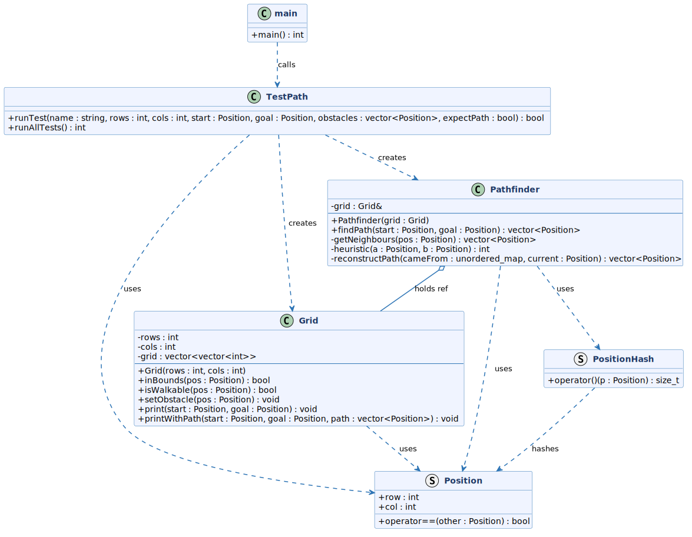

The diagram above illustrates the class structure of my project. Although I produced it after the implementation was complete, it serves as a useful architectural overview before diving into the details of each component. The design follows a strict separation of responsibilities — each component has a single well-defined role and dependencies only flow in one direction: `main` → `TestPath` → `Pathfinder` → `Grid` → `Position`. There are no circular dependencies.

This layered structure was a deliberate design decision I made early on. Keeping the grid logic inside `Grid`, the search logic inside `Pathfinder`, and the test infrastructure inside `TestPath` means each component can be understood, modified, or extended independently. `Pathfinder` holds a reference to `Grid` rather than owning it — `Grid` is created externally and passed in, so the two are loosely coupled. This separation also made testing straightforward — `TestPath` can construct its own isolated `Grid` and `Pathfinder` instances per test without any shared state between scenarios.

### Grid Representation

I implemented the environment as a two-dimensional grid using a `std::vector<std::vector<int>>`. Each cell is either `0` (navigable) or `1` (obstacle). This allows direct access to neighbouring cells using row and column indices, which aligns naturally with grid-based pathfinding.

```cpp
class Grid {
private:
    int rows;
    int cols;
    std::vector<std::vector<int>> grid;
};
```

I chose a dynamic 2D vector because it allows the grid size to be configured at runtime and avoids manual memory management, while still providing the efficient indexed access A* requires.


### Position Abstraction

To represent nodes within the grid, I created a `Position` structure containing row and column coordinates. I use this throughout the project to describe the start, goal, neighbours, and the final path.

```cpp
struct Position {
    int row;
    int col;

    bool operator==(const Position& other) const {
        return row == other.row && col == other.col;
    }
};
```

The `operator==` overload is essential — it allows the algorithm to compare two positions directly with `==`, for example when checking `if (current == goal)`. Without it the compiler would not know how to compare two `Position` values.

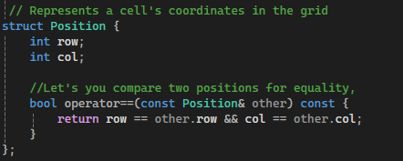

### Boundary Validation

When expanding neighbours, it is possible to generate positions outside the grid. I implemented the `inBounds` function to guard against this:

```cpp
bool Grid::inBounds(const Position& pos) const {
    return pos.row >= 0 && pos.row < rows &&
           pos.col >= 0 && pos.col < cols;
}
```

By centralising this check within `Grid`, all my pathfinding logic can rely on it without duplicating the boundary logic.

### Walkability and Obstacles

I implemented `isWalkable` to combine boundary validation with obstacle checking in a single call:

```cpp
bool Grid::isWalkable(const Position& pos) const {
    return inBounds(pos) && grid[pos.row][pos.col] == 0;
}
```

This means my pathfinder only ever needs to ask one question — "is this walkable?" — and gets a safe answer covering both cases. I handle obstacle placement separately:

```cpp
void Grid::setObstacle(const Position& pos) {
    if (inBounds(pos)) {
        grid[pos.row][pos.col] = 1;
    }
}
```


### Week 1 Outcome

By the end of Week 1, I had a working grid environment with node representation, boundary checking, obstacle placement, and visual output. This foundation meant that Week 2 could focus entirely on search logic without revisiting structural concerns.

- `isWalkable` checks both bounds and whether a cell is blocked
- A small test confirmed obstacles and bounds behave correctly
- No A* logic yet — Week 1 was only about the foundation

---

## Week 2 – Implementing the A* Algorithm

In Week 2, I implemented the core A* pathfinding algorithm. My goal was to move from a working environment to a complete search that finds the shortest path from start to goal while avoiding obstacles.

### Neighbour Generation

The first step was implementing `getNeighbours` as a dedicated helper. From a given position, it generates the four candidate directions and filters them through `isWalkable`:

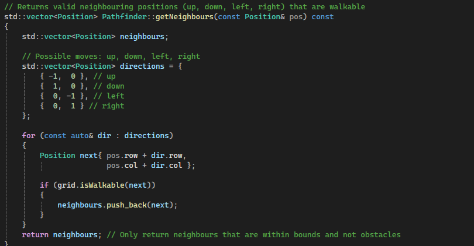

The directions are row/column offsets. For example from `{2,3}`, applying `{-1,0}` gives `{1,3}` (up) and `{0,1}` gives `{2,4}` (right). Any candidate that fails `isWalkable` is discarded before it can cause issues.

### Heuristic Function — Manhattan Distance

The heuristic estimates the remaining distance from any cell to the goal:


This is Manhattan distance — the row gap plus the column gap. It is the correct heuristic for 4-direction movement because with only up/down/left/right available, the minimum steps to the goal can never be less than the row gap plus the column gap. A heuristic must be **admissible** — it must never overestimate — and Manhattan distance satisfies this.

### Core A* Structures

I implemented the main loop using four data structures:

```cpp
std::priority_queue<OpenNode> openSet;
std::unordered_map<Position, int, PositionHash> gScore;
std::unordered_map<Position, Position, PositionHash> cameFrom;
std::unordered_set<Position, PositionHash> closed;
```

**Open set** — a priority queue that always returns the node with the lowest `f = g + h`. The `OpenNode` struct reverses the comparison operator to produce min-heap behaviour:

```cpp
struct OpenNode {
    Position pos;
    int f;

    bool operator<(const OpenNode& other) const {
        return f > other.f; // reversed for min-heap
    }
};
```

**gScore** — the exact cost from start to each explored position. Unlike `h`, this is not an estimate.

**cameFrom** — the breadcrumb trail. Each position maps to where it was reached from, which I use to reconstruct the path at the end.

**Closed set** — positions I have already fully processed. Because the priority queue can contain duplicate entries for the same node, the closed set ensures each node is only expanded once.


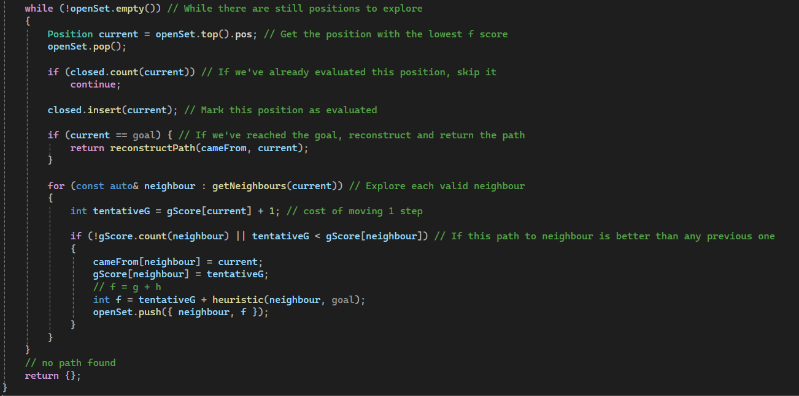

### Path Reconstruction

A* does not build the path as it goes — it only records where each cell was reached from. Once the goal is found, `reconstructPath` follows the `cameFrom` chain backwards:

```cpp
std::vector<Position> Pathfinder::reconstructPath(
    const std::unordered_map<Position, Position, PositionHash>& cameFrom,
    Position current) const
{
    std::vector<Position> path;
    path.push_back(current);

    while (cameFrom.count(current)) {
        current = cameFrom.at(current);
        path.push_back(current);
    }

    std::reverse(path.begin(), path.end());
    return path;
}
```

Starting at the goal, the loop follows each parent back until it reaches the start node — which has no entry in `cameFrom` because nothing led to it. After reversing, the path reads start to goal.

### Visual Output

To confirm correctness, I used `printWithPath` to overlay the path on the grid:

```
S . . . . . .
* . . # . . .
* . . # . . .
* * * # . . .
. . * * * * G
```

`S` = start, `G` = goal, `#` = obstacle, `*` = path, `.` = free cell.


### Week 2 Outcome

By the end of Week 2, I had a fully working A* implementation that finds the shortest path on a grid with obstacles, returns a coordinate sequence, and displays the result visually. The no-path case returns an empty vector cleanly.

---

## Week 3 – Deep Dive: Understanding the Algorithm

Week 3 was dedicated entirely to developing a deeper analytical understanding of how the A* algorithm works internally. Rather than adding new features, I focused on studying the existing implementation closely — tracing through the logic, working through concrete examples, and understanding the reasoning behind each design decision.

### Understanding f, g, and h

The three values that drive all of A*'s decisions:

| Value | What it is | How it's calculated |
|---|---|---|
| `g` | Exact steps taken from start to current cell | Incremented by 1 each step |
| `h` | Estimated steps remaining to goal | Manhattan distance |
| `f` | Combined priority score | `f = g + h` |

`g` is not an estimate — it is the real accumulated cost. `h` is always an estimate. Together they balance how far I have already gone against how far I still have to go.

**Worked example — start `{0,0}`, goal `{4,6}`:**

At the start node:
```
g = 0
h = |0-4| + |0-6| = 4 + 6 = 10
f = 10
```

After one step down to `{1,0}`:
```
g = 1
h = |1-4| + |0-6| = 3 + 6 = 9
f = 10
```

After one step right to `{0,1}` instead:
```
g = 1
h = |0-4| + |1-6| = 4 + 5 = 9
f = 10
```

Both tie at `f = 10` from the start corner — the priority queue picks whichever it stored first. As the search progresses, `h` becomes more discriminating and breaks ties naturally.

**How the heuristic steers the search:**

Consider start `{0,0}`, goal `{4,0}` — directly below. Expanding from start:

- Move down to `{1,0}`: `h = |1-4| + 0 = 3`, `f = 4`
- Move right to `{0,1}`: `h = |0-4| + 1 = 5`, `f = 6`

A* picks `{1,0}` first because `f = 4 < 6`. Moving right increases `h` because it takes you away from the goal column — the heuristic penalises this immediately. The algorithm is steered downward without any explicit direction logic; it emerges from the `f` score alone.

### Analysing the Key Code Block

The neighbour update condition is the most important logic in the algorithm:

```cpp
if (!gScore.count(neighbour) || tentativeG < gScore[neighbour])
{
    cameFrom[neighbour] = current;
    gScore[neighbour] = tentativeG;
    int f = tentativeG + heuristic(neighbour, goal);
    openSet.push({ neighbour, f });
}
```

Breaking down the condition:

- `!gScore.count(neighbour)` — this neighbour has never been visited. I have no record of it, so I must add it.
- `tentativeG < gScore[neighbour]` — I have visited this neighbour before, but I just found a cheaper route to it. Update to the better route.

If neither is true — I've seen this neighbour and already have a route at least as good — I do nothing. This is what guarantees A* finds the optimal path, not just any path.

Inside the block, three things happen in order: the parent is recorded in `cameFrom`, the best known cost is updated in `gScore`, and the neighbour is pushed onto the open set with its new `f` score.

### Why unordered_map and unordered_set

Both structures use hashing for O(1) average lookup. The update condition above runs on every neighbour of every node I expand — potentially thousands of times on a larger grid. Using the ordered alternatives (`map`, `set`) would give O(log n) lookup, which compounds into a meaningful slowdown in a tight search loop.

This is why I added `PositionHash` in `Position.h`:

```cpp
struct PositionHash {
    std::size_t operator()(const Position& p) const noexcept {
        return (static_cast<std::size_t>(p.row) << 32) ^ static_cast<std::size_t>(p.col);
    }
};
```

The unordered containers require a hash function for any custom key type. There is no built-in hash for a struct like `Position`, so I provide one by combining row and column into a single integer.

### Week 3 Outcome

- Deep understanding of `f`, `g`, and `h` developed with concrete worked examples
- Heuristic steering behaviour understood and documented
- Key algorithm blocks analysed line by line
- Understanding of why `unordered_map` and `unordered_set` were chosen over their ordered equivalents

---

## Week 4 – Structured Testing and File Organisation

Week 4 introduced a dedicated test suite for the project. My motivation was twofold: to validate the algorithm across a range of scenarios, and to restructure the codebase in a way that reflects good modern C++ practice.

### Why Separate Test Files

Up to this point, `main.cpp` was doing two jobs — running the program and containing all test logic. In modern C++ development, keeping concerns separated across files is important. A single file that grows to handle multiple responsibilities becomes harder to read, harder to maintain, and harder to extend.

My solution was to introduce two new files: `TestPath.h` and `TestPath.cpp`. All test infrastructure and test cases live in these files, and `main.cpp` is reduced to a clean entry point that simply calls `runAllTests()` and reports the result.

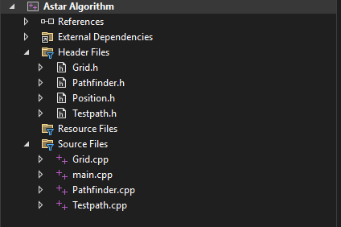

This separation mirrors how real C++ projects are structured — functionality is split into focused modules, headers declare the interface, and source files contain the implementation. It also means that if I want to add a new test in the future, I only need to touch `TestPath.cpp` — `main.cpp` requires no changes at all.

### The runTest Helper

Rather than repeating boilerplate for every scenario, I wrote a single `runTest` function that handles the full lifecycle of each test — building the grid, placing obstacles, running the pathfinder, printing the grid and result, and comparing against the expected outcome:

```cpp
bool runTest(const std::string& name,
             int rows, int cols,
             const Position& start,
             const Position& goal,
             const std::vector<Position>& obstacles,
             bool expectPath)
```

Each test case is a single self-documenting call. `runAllTests` in `TestPath.cpp` calls `runTest` once per scenario and returns the total number passed to `main`.

### Test Cases

I implemented eight test cases covering a range of normal and edge case scenarios:

| # | Scenario | Expected |
|---|---|---|
| 1 | Basic vertical wall, path goes around | Path found |
| 2 | Goal surrounded on all 4 sides | No path |
| 3 | Start equals goal | Path of length 1 |
| 4 | Full vertical wall, grid cut in two | No path |
| 5 | Open grid, no obstacles | Path found |
| 6 | Obstacle placed directly on start | No path |
| 7 | Obstacle placed directly on goal | No path |
| 8 | Narrow corridor, single valid route | Path found |

**Tests 1 and 5** cover the standard path-finding case — with and without obstacles — confirming the algorithm returns a valid path.

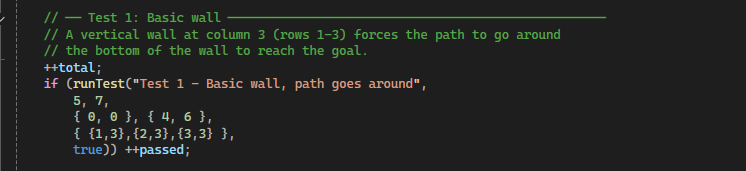

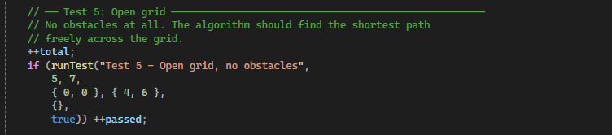

**Test 2** confirms the algorithm returns an empty path rather than crashing or looping when the goal is completely surrounded.

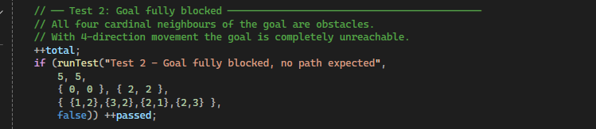

**Test 3** handles the trivial edge case — start and goal are the same position. `reconstructPath` returns a vector containing just that single node.

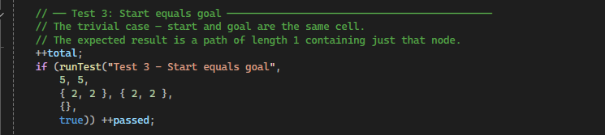

**Test 4** proves the no-path case works when it is geometrically impossible to reach the goal, not just locally blocked.

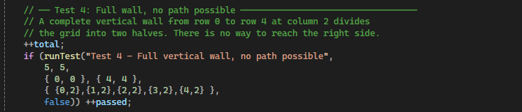

**Tests 6 and 7** were the most revealing. Placing an obstacle on the start or goal exposed a real bug in my original implementation — `findPath` was pushing the start onto the open set unconditionally without ever checking if it was walkable. This meant an obstacle on the start had no effect. The fix was a two-line early return I added to `findPath`:

```cpp
if (!grid.isWalkable(start) || !grid.isWalkable(goal))
    return {};
```

This is a good example of testing catching a genuine correctness issue rather than just confirming known behaviour.

**Test 8** creates a narrow corridor that forces the algorithm through a single gap in a wall, making the output easy for me to verify by visual inspection.

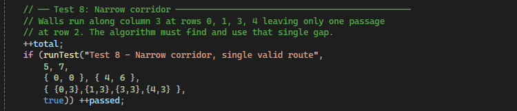

### Full Test Summary

All 8 of my tests pass:

```
========================================
  SUMMARY: 8 / 8 tests passed
========================================
```

### Week 4 Outcome

- `main.cpp` reduced to a clean entry point
- Test logic separated into `TestPath.h` and `TestPath.cpp`
- 8 structured test cases covering standard paths, blocked goals, edge cases, and impossible scenarios
- Tests 6 and 7 caught a real bug in `findPath` that I fixed as a result
- All 8 tests pass

---

## Modern C++ Usage

Throughout this project I made deliberate use of features introduced in C++11 and later. Coming from a C background, these required learning but each one directly improved the safety, readability, or correctness of my code.

### `auto` for type inference

```cpp
auto path = pathfinder.findPath(start, goal);
```

Instead of writing `std::vector<Position>` explicitly, `auto` lets the compiler deduce the type from context. The type is still fully enforced at compile time — `auto` reduces verbosity without losing type safety.

### Range-based for loops

```cpp
for (const auto& neighbour : getNeighbours(current))
for (const auto& dir : directions)
```

Rather than manually indexing with `i` and accessing elements by index, range-based for loops express intent directly — "for each element in this collection." `const&` ensures the element is read-only and no unnecessary copy is made.

### `const` correctness

```cpp
bool inBounds(const Position& pos) const;
bool isWalkable(const Position& pos) const;
```

Methods I marked `const` at the end of their signature guarantee they will not modify the object's state — enforced by the compiler, not just convention. Parameters passed as `const&` are passed by reference (no copy) but cannot be modified inside the function. In C there is no equivalent enforcement mechanism.

### STL containers

```cpp
std::priority_queue<OpenNode> openSet;
std::unordered_map<Position, int, PositionHash> gScore;
std::unordered_set<Position, PositionHash> closed;
std::vector<std::vector<int>> grid;
```

Rather than implementing a priority queue, hash map, or hash set manually, I used well-tested Standard Library implementations. I chose each container for a specific reason — `priority_queue` for O(1) access to the lowest `f` node, `unordered_map` and `unordered_set` for O(1) average lookup during the search loop, and `vector` for dynamic resizable storage without manual memory management.

### `std::reverse`

```cpp
std::reverse(path.begin(), path.end());
```

Rather than writing a manual swap loop, `std::reverse` expresses the intent in a single named operation. `path.begin()` and `path.end()` are iterators — a modern C++ concept that generalises the idea of a pointer into a container.

---

## Reflection and Learning Outcomes

### Applying C++ Concepts from Class

**Constructors and member initialiser lists**

One of the first C++ concepts I applied was the constructor with a member initialiser list in the `Grid` class:

```cpp
Grid::Grid(int rows, int cols)
    : rows(rows), cols(cols), grid(rows, std::vector<int>(cols, 0))
```

In class I learned that member initialiser lists initialise members directly at construction rather than assigning them inside the body. This project showed me why that matters in practice — `grid` is a `vector<vector<int>>` with no sensible default state, so it must be initialised with the correct dimensions at construction time. Doing it in the body would mean default-constructing an empty vector and then overwriting it, which is wasteful.

The `Pathfinder` constructor uses the same pattern:

```cpp
Pathfinder::Pathfinder(const Grid& grid)
    : grid(grid)
```

Here the member initialiser list is the *only* way to initialise a reference member — references cannot be assigned after construction, only initialised.

**Operator overloading**

In class I learned how C++ allows operators to be redefined for custom types. This project required two operator overloads. The first was `operator==` on `Position`:

```cpp
bool operator==(const Position& other) const {
    return row == other.row && col == other.col;
}
```

Without this, writing `if (current == goal)` in the A* loop would not compile — the compiler has no built-in way to compare two custom structs. The overload makes my algorithm code read naturally.

The second was `operator<` on `OpenNode`:

```cpp
bool operator<(const OpenNode& other) const {
    return f > other.f;
}
```

This one is more subtle. `std::priority_queue` is a max-heap by default — it returns the largest element first. By reversing the comparison (returning `f > other.f` instead of `f < other.f`), I make the priority queue behave as a min-heap, always returning the node with the lowest `f` score. This is a direct application of operator overloading to control the behaviour of an STL container.

**References and const references**

Coming from C, pointers were the only way I knew to avoid copying data into a function. In this project, I used references throughout:

```cpp
Pathfinder::Pathfinder(const Grid& grid)
bool Grid::inBounds(const Position& pos) const
```

`const Grid&` passes the grid by reference so no copy is made, while `const` guarantees the function cannot modify it. Understanding the difference between passing by value, by pointer, and by reference was one of the more important transitions I made from C to C++.

---

### Biggest Challenges

**Structuring the project across multiple files**

The biggest practical challenge I faced was managing a multi-file C++ project correctly. In C, splitting code across files is straightforward — headers declare things, source files define them. In C++, classes add complexity: the header must declare the full class interface, the source file defines the methods, and every file that uses the class must include the correct header.

The issue that caused me the most friction was understanding what belongs in a header versus a source file, and keeping includes consistent. The `TestPath.h` error I encountered during development — where `std::string`, `Position`, and `std::vector` were used without being included — was a direct result of this. The fix reinforced something important: a header must be self-contained and cannot rely on whatever the including file happened to include first.

**C++ syntax coming from C**

Coming from a C background, several C++ patterns required adjustment. The most significant were reference semantics (`&` instead of `*`), `const` on method signatures, and the STL container syntax. In C, a function that takes a pointer makes it obvious that no copy is being made. In C++, `const Position&` achieves the same thing but looks different. Building familiarity with these patterns took time but made my final code significantly cleaner than an equivalent C-style implementation would have been.

---

### Learning Outcomes

**Understanding A* deeply**

Before this project, A* was an algorithm I had heard of but never implemented. Working through it from scratch — building the grid first, then the heuristic, then the full search loop, then path reconstruction — built a much deeper understanding than reading about it would have. The key insight for me was understanding why `f = g + h` works: `g` keeps the search honest about how far it has already travelled, and `h` steers it toward the goal. Neither alone is sufficient.

**Multi-file C++ project structure**

By the end of the project, structuring code across `.h` and `.cpp` files felt natural to me. The discipline of keeping headers self-contained, separating interface from implementation, and organising responsibilities across classes (`Grid`, `Pathfinder`, `TestPath`) is something I will carry forward into future C++ projects.

**Comfort with C++ classes**

This project was the first time I used C++ classes extensively in a real implementation rather than in exercises. Seeing how `const` correctness, member initialiser lists, operator overloading, and encapsulation work together in a functioning program made those concepts concrete in a way that isolated examples did not.

---

## AI Usage

Throughout this project I used Claude (Anthropic) as a learning and development tool. This section documents exactly how I used it.

### How I used AI

**Concept explanation** — Coming from a C background, many C++ features needed explanation before I could use them confidently. I used Claude to understand `unordered_map`, `priority_queue`, reference semantics, `const` correctness, and the difference between ordered and unordered STL containers.

**Algorithm understanding** — I worked through the A* algorithm interactively, asking questions about the relationship between `g`, `h`, and `f`, why admissibility matters for the heuristic, why `reconstructPath` is needed rather than building the path during the search, and how the neighbour update condition guarantees optimality.

**Worked examples** — Concrete examples such as the `{0,0}` to `{4,0}` tiebreaker scenario and the `{0,0}` to `{4,6}` heuristic calculation were worked through in conversation to build my intuition before I documented them in the report.

**Code review** — After writing my implementations, I discussed them with Claude to check for correctness. One issue identified was in `PositionHash`: on 32-bit systems where `size_t` is 32 bits, shifting by 32 is a no-op and causes more hash collisions. On the 64-bit systems my project targets it works correctly, but it is a portability limitation worth noting.

**Report structure and effective writing** — Claude helped me identify that my report needed more analytical depth — explaining *why* decisions were made rather than just *what* was done — and helped me structure the content to meet the requirements.

### What remained my own work

- All design decisions — class structure, separation of `Grid`, `Pathfinder`, and `Position`, choice of STL containers
- Writing and understanding every function
- Test case design — choosing which scenarios to test and what the correct expected outcomes are
- Debugging and verifying output against expected results
- All code in the repository

### Reflection on AI use

Using AI as a learning tool rather than a solution generator made my process more effective. Asking "why does this work?" rather than "write this for me" built genuine understanding that I can demonstrate and defend. Every piece of code in this project is something I can explain line by line.

---

## References and Tools Used

**Lecturer Material**
- Lynch, M. (2025). *C++ Programming – A\* Algorithm Project Brief and Rubric*. ATU Galway.
 
**AI Tools**
- Anthropic. (2025). *Claude (claude.ai)*. Used for concept explanation, algorithm understanding, code review, and report structuring. [https://claude.ai](https://claude.ai)
- OpenAI. (2025). *ChatGPT*. Used for project timeline planning and scheduling. [https://chat.openai.com](https://chat.openai.com)
 
**Diagramming**
- PlantUML. (2025). *PlantUML – Open-source UML diagram tool*. Used to generate the class diagram. [https://plantuml.com](https://plantuml.com)
 
**Reference Material**
- cppreference.com. (2025). *C++ Standard Library reference*. Used for STL container documentation (`std::priority_queue`, `std::unordered_map`, `std::unordered_set`). [https://en.cppreference.com](https://en.cppreference.com)
